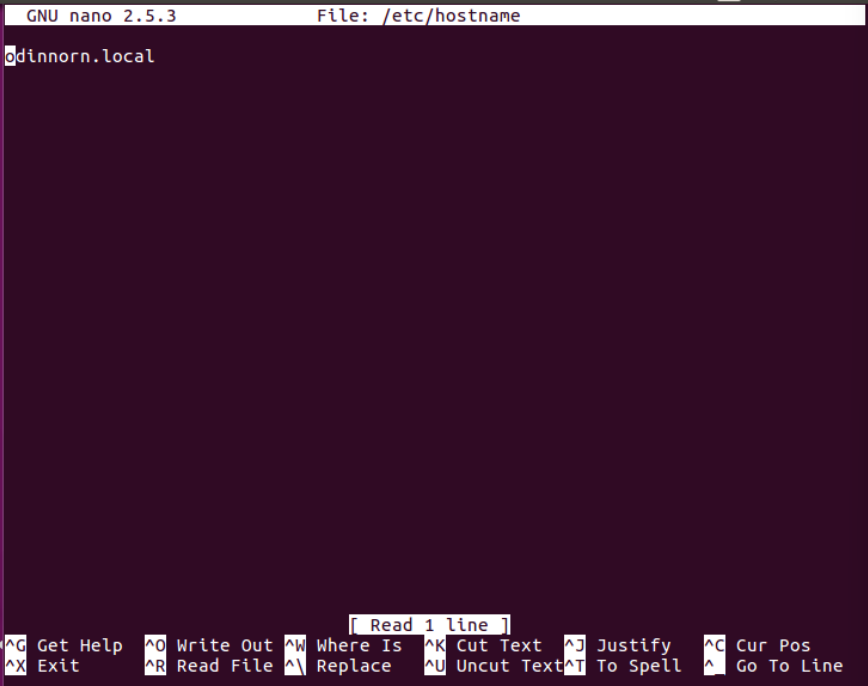
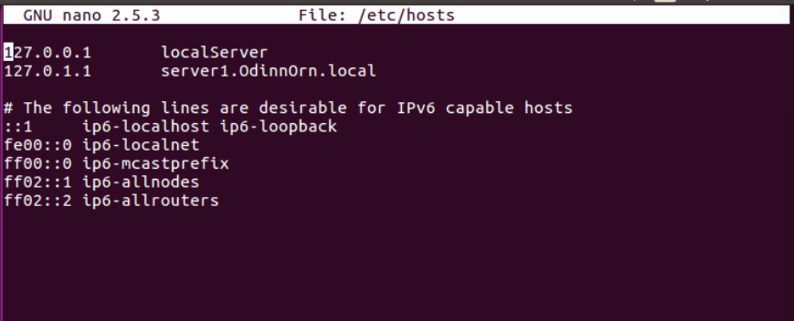
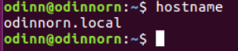

# 3) Configure the hostname of server1 as server1 and domain “YourName.local”, so the FQDN of the server will be server1.yourname.local

fyrst go to your server and open the terminal. Edit the /hostname file
```bash
sudo nano /etc/hostname
```
> remember to save and close with
> Ctrl+o (save) Ctrl+x (exit)

replace the curent name with *yourname.local*(replace yourname with desired name). It should now look something like this



Next edit the /hosts file.
```bash
sudo nano /etc/hosts
```
modify line 2 to be
```
127.0.0.1 server1.newname.local
```


then reboot with:
```bash
sudo reboot
```

### to test if everything works do
```bash
hostname
```

