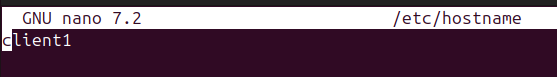
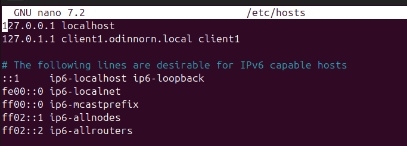
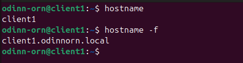

# 3) Configure client1 hostname as client1 and FQDN as client1.yourname.local
(this step is near identical to  step 2)

fyrst go to your client and open the terminal. Edit the /hostname file
```bash
sudo nano /etc/hostname
```
> remember to save and close with
> Ctrl+o (save) Ctrl+x (exit)

replace the curent name with *client1*



Next edit the /hosts file.
```bash
sudo nano /etc/hosts
```
modify line 2 to be
```
127.0.0.1 client1.newname.local client1
```


then reboot with:
```bash
sudo reboot
```

### to test if everything works do
```bash
hostname
hostname -f
```

