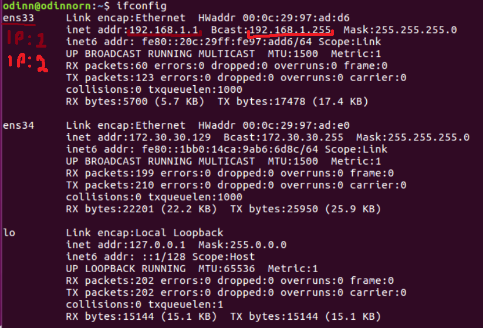
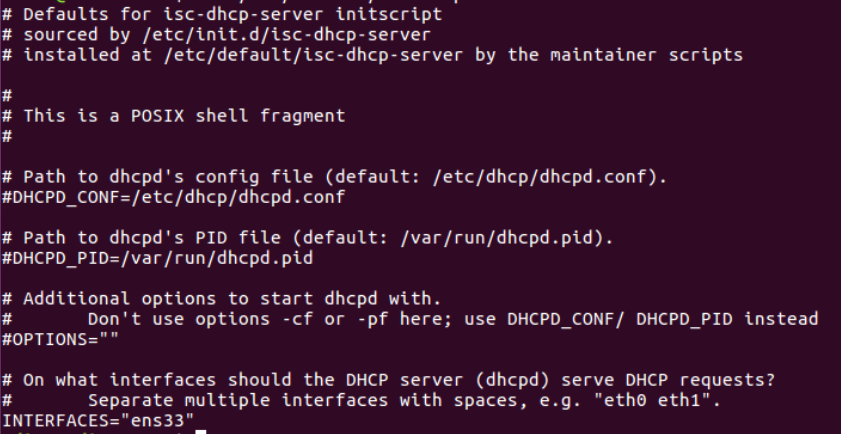

# 4)  Install and configure DHCP protocol ( isc-dhcp-server) on server1, and make sure the Client1 gets an automatic IP Address, Default Gateway, Domain Name, and DNS automatically from DHCP on server1. 
Open server1
Then start by checking your ip with *ifconfig*



Remember the Name and ip of the top one
replace every instance of ip.ip.ip.ip with your ip and ip-name with your ip name

install dhcp

```bash
sudo apt-get install isc-dhcp-server
```

Open the isc-dhcp-server
```bash
sudo nano /etc/default/isc-dhcp-server
```

Scroll down to the bottom en change INTERFACES="" to INTERFACES="ip-name"
save and close 



Next open /dhcpd.conf
```bash
sudo nano /etc/dhcp/dhcpd.conf
```

replace the code in the file for the following
```bash
subnet 192.168.30.0 netmask 255.255.255.0 {
  range 192.168.30.100 192.168.30.200;
  option subnet-mask 255.255.255.0;
  option routers 192.168.30.1;
  option broadcast-address 192.168.30.255;
  option domain-name-servers ns1.internal.example.org;
  option domain-name "internal.example.org";
  default-lease-time 600;
  max-lease-time 7200;

```
<image tytle="dhcpd" width="600" src="ImageFolder/dhcpd.png">

now restart
```bash
sudo reboot
```

here are commands to control the dhcp notably status
```bash
sudo systemctl start isc-dhcp-server
sudo systemctl stop isc-dhcp-server
sudo systemctl restart isc-dhcp-server
sudo systemctl status isc-dhcp-server

sudo systemctl enable isc-dhcp-server
sudo systemctl diable isc-dhcp-server
```

run the status command, it should look like this

<image tytle="Status" width="600" src="ImageFolder/dhcpStatus.png">


